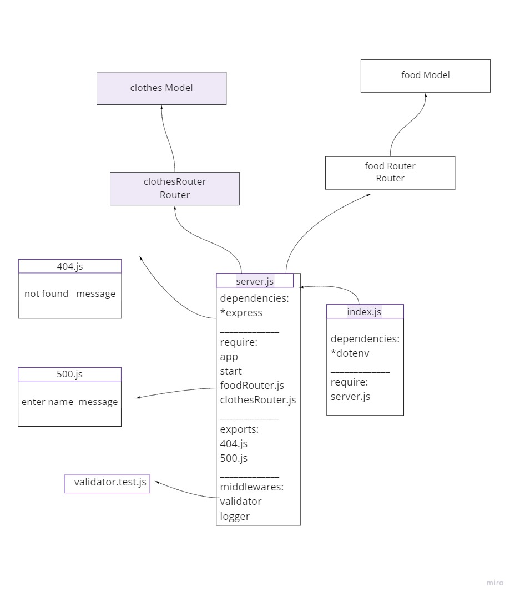

# basic-api-server

## URLs : 

### Heroku applications :

[server-deploy-dev](https://basic-api-server-dev1.herokuapp.com/)

[server-deploy-main](https://basic-api-server-dina.herokuapp.com/)

### Github actions:

[actions](https://github.com/DinaSami/basic-api-server/actions)

### pull request:

[PR](https://github.com/DinaSami/basic-api-server/pull/1)

## Drawings:

### UML  



## Notes:

### CI/CD (continuous integration , continuous deployment)

The "CI" refers to continuous integration, it is an automation process fro developers that means changes to an app is regularly built and merged to a repo, So that can be a good solutions when there are multiple branches of an app .

The "CD"  refers to continuous deployment , which is automatically release developer's changes from the repo to production , for exapmle we can use He

I install the app or library by typing (npm install -the library's name)

```
npm install express
```
I test the app or library by typing (npm test)

```
npm test 
```

I run the app by typing this command (nodemon)

I set up the app by typing this command (npm init -y)

